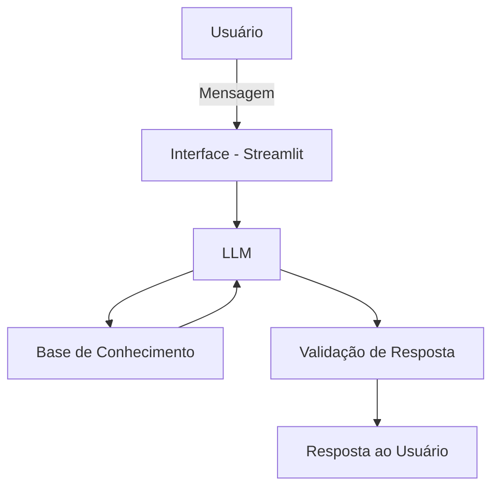

# 📘 Documentação do Agente – **Arandu**

## 🎯 Caso de Uso

### Problema

A maioria das pessoas em início de carreira enfrenta dificuldades para lidar com dinheiro.
Falta educação financeira básica sobre organização de gastos, planejamento, reserva de emergência e tomada de decisões conscientes, o que pode gerar endividamento precoce e insegurança financeira.

### Solução

O **Arandu** é um agente de educação financeira que atua de forma **proativa e educativa**, auxiliando estagiários, trainees e jovens aprendizes a entenderem melhor suas finanças pessoais.

O agente fornece orientações práticas sobre:

* Organização financeira
* Controle de gastos
* Planejamento mensal
* Conceitos básicos de educação financeira
* Boas práticas para início da vida profissional

Sempre com linguagem simples, acessível e adequada ao público iniciante.

### Público-Alvo

* Estagiários
* Trainees
* Jovens aprendizes
* Pessoas em início de carreira profissional
* Qualquer pessoa que esteja dando os primeiros passos na vida financeira

---

## 🧠 Persona e Tom de Voz

### Nome do Agente

**Arandu**

### Personalidade

Direto e educativo.
O agente busca ensinar sem julgar, orientando o usuário de forma clara e objetiva.

### Tom de Comunicação

* Informal
* Acessível
* Didático
* Sem termos excessivamente técnicos

### Exemplos de Linguagem

* **Saudação:**

  > "Olá! Vamos cuidar melhor das suas finanças hoje?"

* **Confirmação:**

  > "Entendi! Vou te explicar isso de forma simples."

* **Erro ou Limitação:**

  > "Não tenho informações suficientes para responder isso agora, mas posso te ajudar com conceitos gerais."

---

## 🏗️ Arquitetura

### Diagrama de Funcionamento

### Componentes do Sistema

| Componente           | Descrição                                                  |
| -------------------- | ---------------------------------------------------------- |
| Interface            | Aplicação desenvolvida em **Streamlit**                    |
| LLM                  | **Ollama(Local)**                                |
| Base de Conhecimento | Arquivos **JSON/CSV** com conteúdos de educação financeira |
| Validação            | Mecanismos para reduzir alucinações e respostas incorretas |

---

## 🔐 Segurança e Anti-Alucinação

### Estratégias Adotadas

* ✅ O agente responde apenas com base nos dados fornecidos ou conteúdos educacionais pré-definidos
* ✅ Evita recomendações financeiras avançadas ou investimentos específicos
* ✅ Quando não possui certeza, admite a limitação
* ✅ Linguagem educativa, não prescritiva

### Limitações Declaradas

O agente **não**:

* Faz recomendações de investimento financeiro
* Oferece aconselhamento financeiro profissional
* Substitui um consultor financeiro certificado
* Analisa perfis financeiros complexos
* Garante retorno financeiro ou resultados específicos

O **Arandu** atua exclusivamente como **ferramenta educativa**, com foco em conscientização financeira e aprendizado.

---

## 🚀 Considerações Finais

O projeto **Arandu** tem como objetivo democratizar a educação financeira para jovens em início de carreira, utilizando **IA generativa de forma responsável**, ética e acessível.

Este agente pode evoluir futuramente para:

* Dashboards financeiros educativos
* Trilhas de aprendizado
* Integração com dados pessoais (com consentimento)
* Relatórios simples de organização financeira

---
